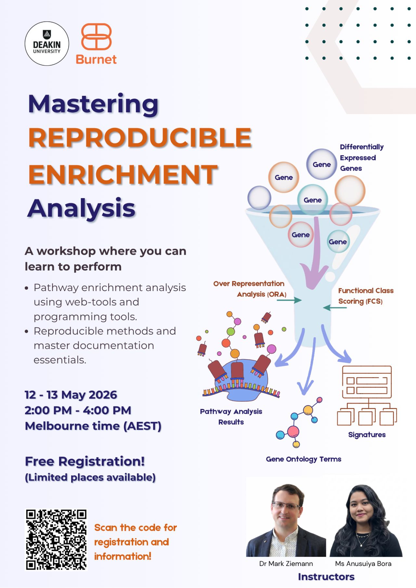

Join us for a 2-part workshop on Mastering Reproducible Enrichment Analysis! 📊

Presented by Anusuiya Bora and myself, with a focus on reproducibility and best practices.

📅 When: 12 and 13 May 2026

🕑 Time: 2:00 PM – 4:00 PM (AEST)

📍 Where: Online 

💰 Cost: FREE for academic sector (places are limited!)

🔗Registration form link: https://tinyurl.com/ye262hzx

